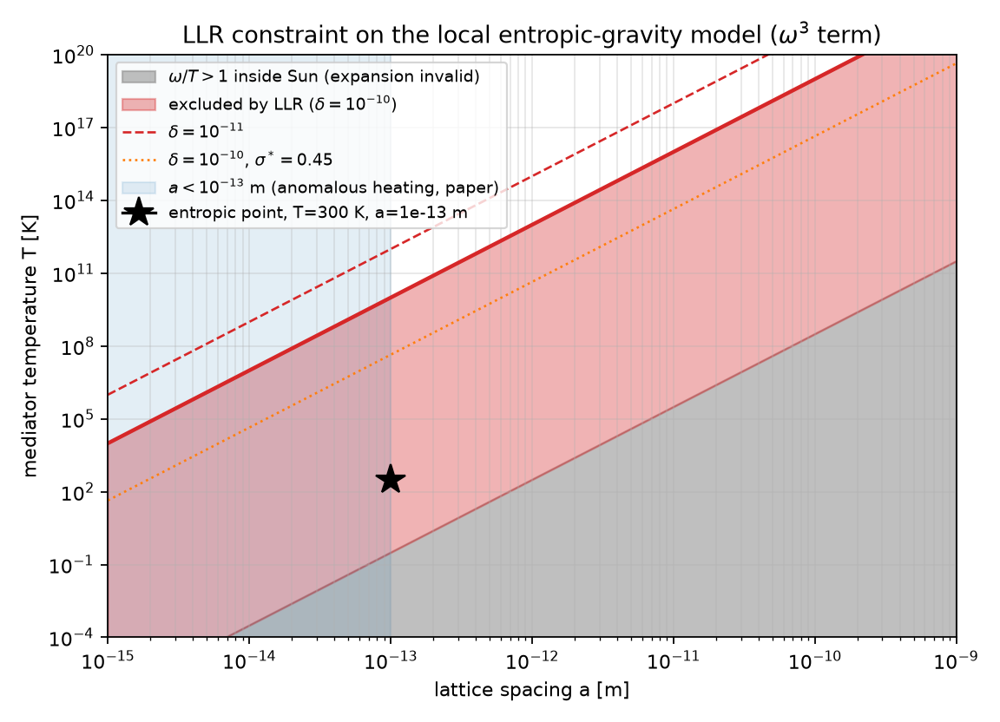

# entropic-gravity-3body

Exact three-body force from the ω³ term of the local entropic-gravity model of Carney et al. (PRX 15, 031038), plus a lunar laser ranging constraint.



*Region of the (temperature, lattice spacing) plane excluded by lunar laser ranging; the star is the paper's benchmark point.*

I read the paper, liked it, and got curious about the ω³ term that the free-energy expansion drops after reproducing Newton at order ω². It turned out to have an exact closed form: the three-center integral sits precisely at the uniqueness point of the star-triangle relation, so the whole geometric dependence collapses to π³ over the product of the three separations. From there the rest of the night followed: what the discarded term actually predicts, which part of it survives honest scrutiny, and what the Moon says about it.

## The result in three lines

1. The cubic term generates a genuinely long-range three-body potential, V₃ = (1−2σ*)·G·m₁m₂m₃·L²/(T·d₁₂·d₁₃·d₂₃), exact at a→0. Derivation by conformal inversion in [section 2.1 of the writeup](writeup/three_body_entropic.md).

2. The accompanying two-body piece (the ℓᵢ²ℓⱼ terms) is UV-divergent and lives exactly where the expansion fails, so the perturbative version is an artifact. Treated non-perturbatively, the free energy saturates within r* = √(ℓ/T) of a point mass and the correction becomes finite but source-structure dependent. See [section 2.2](writeup/three_body_entropic.md).

3. Lunar laser ranging then bounds Λ ≡ (1−2σ*)·L²/T in layers: an assumption-free floor from V₃ alone (Λ < 8.3e-10 GeV⁻³, i.e. T_min = 4.4 K at a = 1e-13 m) and a realistic extended-body bound about nine orders stronger (T ≳ 1e10 K). Numbers and scaling in [section 3](writeup/three_body_entropic.md).

## Run it

```bash
git clone https://github.com/ivo434/entropic-gravity-3body.git
cd entropic-gravity-3body
uv venv && uv pip install -r requirements.txt
uv run pytest tests/
uv run python notebooks/task2b_nonperturbative.py
```

The test suite is 33 checks: the symbolic expansion of g(ω), regression values for every integral, the sign audit, the closed forms, and a 1% consistency gate between the non-perturbative machinery and perturbation theory in its validity regime. If you prefer your own environment, any Python 3.11+ venv with `pip install -r requirements.txt` works the same. The notebooks `task1_i3.py`, `task2_j.py` and `task3_llr.py` reproduce the intermediate studies.

## What I'd trust and what I wouldn't

Everything here is non-relativistic and static-source; nothing is claimed beyond that. The adiabatic (fast-thermalization) assumption of the paper is inherited, not checked. The extended-body bound uses uniform-sphere structure factors, good to O(1) and conservative for the Sun. The LLR criterion is a fractional-acceleration cut on the modulating signal, not a full orbit fit; the V₃-only floor is the number I would defend anywhere.

## References and citing

Carney, Karydas, Scharnhorst, Singh, Taylor, "On the quantum mechanics of entropic forces", PRX 15, 031038 (2025), arXiv:2502.17575. Symanzik, "On calculations in conformal invariant field theories" (1972), for the star-triangle relation. Hu and Yu, arXiv:2201.06200, for the contrasting three-body scaling in linearized quantum gravity. To cite this repo, see [CITATION.cff](CITATION.cff).

Built in one long night with heavy AI assistance for code and numerics; every result is gated by the test suite and was independently re-derived where it matters.
